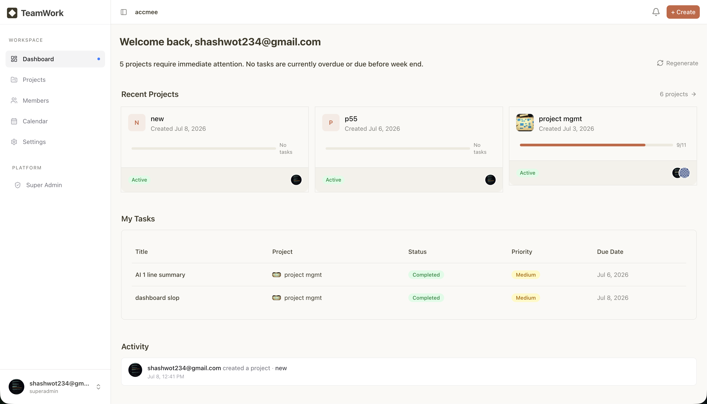
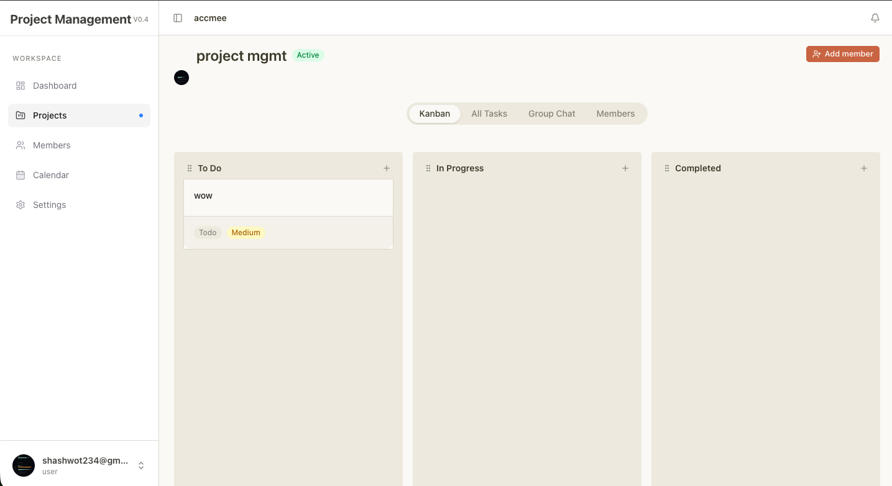
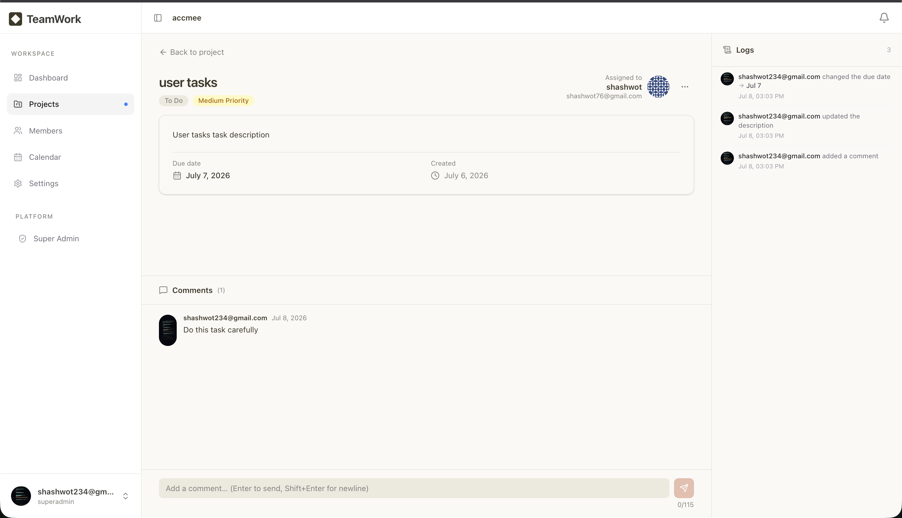
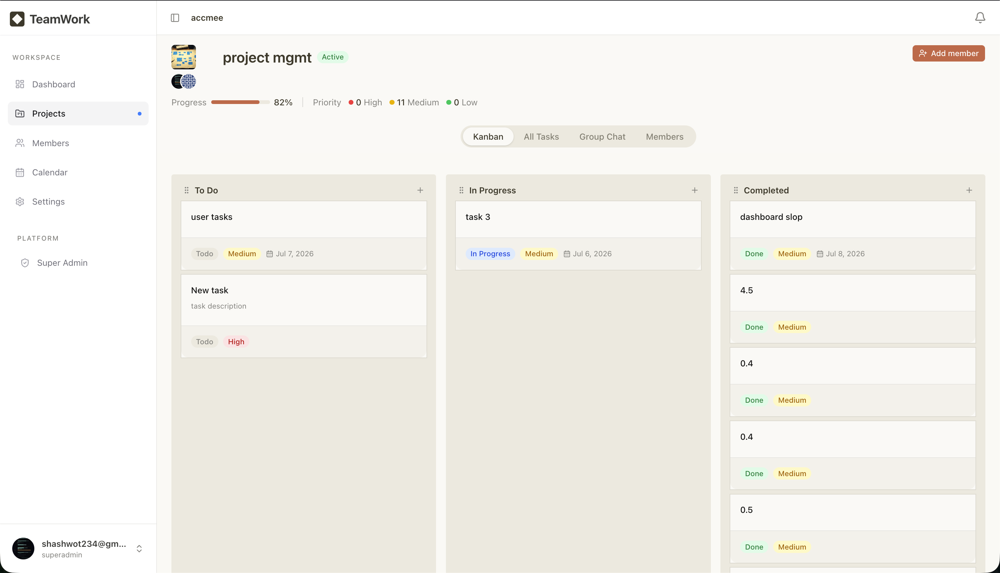
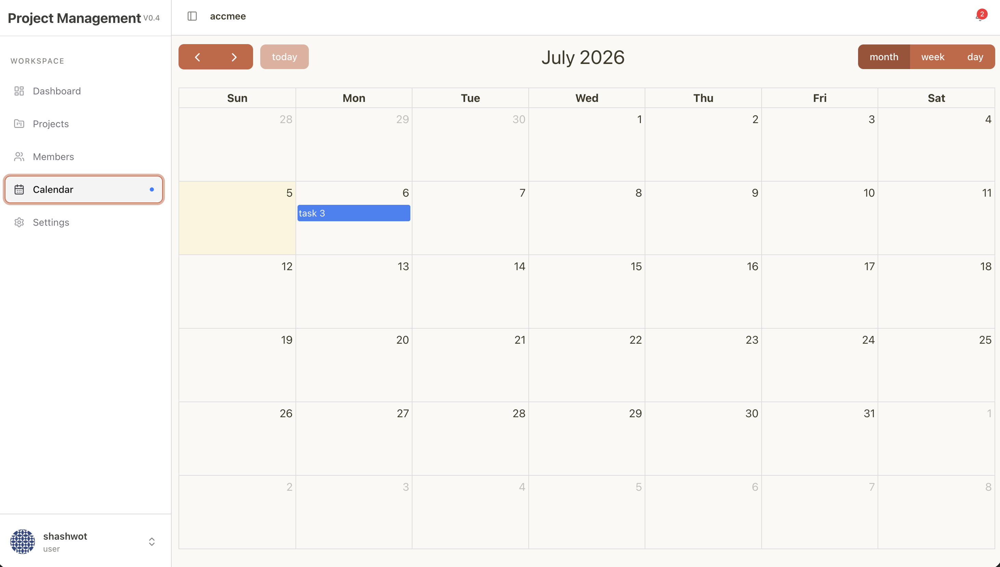
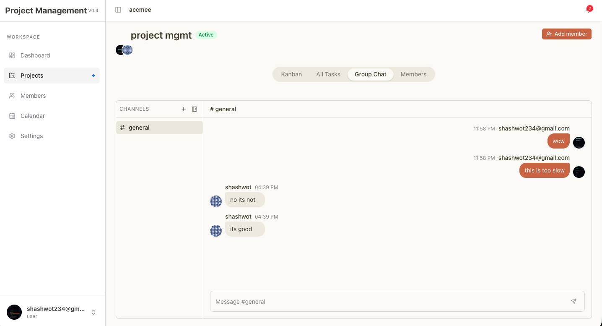

# TeamWork —  Project Management Platform

A multi-tenant project management platform built as part of the Arbyte Software Engineering Mentorship 2026. Teams can create organizations, run projects on Kanban boards, chat in real time, and track deadlines on a calendar.

**Live:** [teamwork.shashwotghimire.com.np](https://teamwork.shashwotghimire.com.np)

---

## Features

**Auth**
- Register, email verification, JWT login
- Avatar upload via S3, Gravatar fallback

**Organizations**
- Create and manage organizations
- Invite members by email (accept / decline flow)
- Roles: Organization Admin, Member, Super Admin

**Projects**
- Create projects inside an organization
- Per-project member management
- Progress stats (todo / in progress / completed counts)
- Archive projects

**Kanban board**
- Drag-and-drop tasks across status columns (dnd-kit)
- Priority levels (low, medium, high)
- Due dates with overdue highlighting
- Task reassignment

**Tasks**
- Comments with edit / delete
- Activity log
- Calendar view of due dates (FullCalendar)
- "My tasks" filtered view

**Chat**
- Per-project channels
- Real-time messaging via Socket.IO

**Notifications**
- In-app notification bell with live unread count
- Email notifications for: invitations, task assignments, reassignments, status changes, completions, due-soon reminders, overdue alerts, new comments, new chat messages
- Background email queue (BullMQ + Redis)

**AI**
- Organization activity summary generated via Claude (AWS Bedrock)
- Force-regenerate on demand

**Super Admin panel**
- Platform-wide stats
- List and search all organizations and users
- Block / unblock organizations

---

## Tech stack

| Layer | Tech |
|---|---|
| Frontend | Next.js 16, React 19, TypeScript, Tailwind CSS 4, shadcn/ui |
| State / Data | Zustand 5, TanStack Query 5, Axios |
| Backend | Node.js, Express 5, TypeScript |
| Database | PostgreSQL, Sequelize 6 ORM |
| Real-time | Socket.IO 4 |
| Queue / Cache | BullMQ, Redis (ioredis) |
| Email | Nodemailer |
| File storage | AWS S3, s3-request-presigner |
| AI | Anthropic Claude via AWS Bedrock |
| Auth | JWT, bcrypt |
| Validation | Zod 4 |
| Drag and drop | dnd-kit |
| Calendar | FullCalendar |

---

## Project structure

```
project-management/
├── api/          # Express REST API + Socket.IO server + BullMQ workers
├── web/          # Next.js frontend
└── docker-compose.yml
```

### API layout

```
api/src/
├── app.ts / server.ts / worker.ts
├── configs/          # DB, Redis, nodemailer, Sequelize, Bedrock
├── routes/           # One file per resource
├── controllers/      # Thin: parse request, call service, return ApiResponse
├── services/         # Business logic
├── repositories/     # All DB queries via Sequelize, no raw SQL
├── models/           # Sequelize models + associations
├── middlewares/      # auth (JWT), superadmin gate, Zod validation, multer, error handler
├── queues/           # BullMQ email + reminder queues
├── workers/          # email.worker, reminder.worker
├── ws/               # Socket.IO setup and notification events
├── validations/      # Zod schemas per resource
└── helpers/          # ApiError, ApiResponse, asyncHandler, JWT, bcrypt wrappers
```

### Web layout

```
web/src/
├── app/
│   ├── (auth)/              # login, register, verify-email, invite
│   └── (dashboard)/         # protected pages
│       ├── admin/           # super admin panel
│       ├── onboarding/
│       ├── profile/
│       └── organization/[id]/
│           ├── calendar/
│           ├── members/
│           ├── settings/
│           └── projects/[projectId]/
│               └── tasks/[taskId]/
├── features/        # Components + hooks co-located per domain
├── services/        # Typed Axios wrappers per resource
├── store/           # Zustand stores
└── types/           # API response interfaces
```

---

## Setup

### Prerequisites

- Node.js 20+
- PostgreSQL 15+
- Redis 7+
- AWS account (S3 bucket + Bedrock access for Claude)
- SMTP credentials (Gmail app password works)

### 1. Clone

```bash
git clone <repo-url>
cd project-management
```

### 2. API setup

```bash
cd api
cp .env.example .env
# Fill in .env (see environment variables section below)
npm install
```

Run database migrations:

```bash
npx sequelize-cli db:migrate
```

Start the dev server (hot reload):

```bash
npm run dev
```

Start the background worker (email + reminders) in a second terminal:

```bash
npx tsx src/worker.ts
```

### 3. Web setup

```bash
cd web
cp .env.example .env.local
# Set NEXT_PUBLIC_API_URL and NEXT_PUBLIC_SOCKET_URL
npm install
npm run dev
```

### 4. Docker (all-in-one)

A `docker-compose.yml` at the repo root starts the API, web, PostgreSQL, and Redis together:

```bash
docker compose up --build
```

---

## Environment variables

### API (`api/.env`)

```env
PORT=8080

# PostgreSQL
PGHOST=localhost
PGPORT=5432
PGDATABASE=projectmgmt
PGUSER=postgres
PGPASSWORD=yourpassword
PGSSLMODE=disable

# Redis
REDIS_HOST=localhost
REDIS_PORT=6379
REDIS_PASSWORD=

# Auth
JWT_SECRET=your-secret-key

# Email (nodemailer / SMTP)
EMAIL_USER=you@gmail.com
EMAIL_PASS=your-app-password

# CORS
FRONTEND_ORIGIN=http://localhost:3000

# AWS (S3 + Bedrock)
AWS_REGION=us-east-1
AWS_ACCESS_KEY_ID=
AWS_SECRET_ACCESS_KEY=
```

### Web (`web/.env.local`)

```env
NEXT_PUBLIC_API_URL=http://localhost:8080/api
NEXT_PUBLIC_SOCKET_URL=http://localhost:8080
```

---

## Database

This project uses Sequelize migrations. The `api/migrations/` directory contains 15 migration files that build the full schema incrementally.

### Run migrations

```bash
cd api
npx sequelize-cli db:migrate
```

### Undo last migration

```bash
npx sequelize-cli db:migrate:undo
```

### Undo all migrations

```bash
npx sequelize-cli db:migrate:undo:all
```

### Schema overview

| Table | Description |
|---|---|
| `users` | Accounts, roles (user / superadmin), email verification, Gravatar URL |
| `organizations` | Org name, admin, logo, website, blocked flag |
| `organization_members` | Many-to-many: users in orgs, with `userRoleInOrg` (member / org_admin) |
| `invitations` | Email invites with status (pending / accepted / declined) and token |
| `projects` | Projects within an org, status (active / archived) |
| `project_members` | Many-to-many: users in projects |
| `tasks` | Title, description, status (todo / in_progress / completed), priority, position, due date, assignee |
| `comments` | Task comments |
| `channels` | Chat channels scoped to a project |
| `messages` | Channel messages |
| `notifications` | In-app notifications per user |
| `ai_summaries` | Cached AI org summaries |

---

## API documentation

Interactive API docs (Swagger UI) are available at:
**[api.shashwotghimire.tech/api/api-docs](https://api.shashwotghimire.tech/api/api-docs)**

---

## Frontend usage guide

### Getting started

1. Register at `/register`. A verification email will be sent.
2. Click the link in the email to verify your address, then log in.
3. On the onboarding page, create a new organization or accept a pending invite.

### Organization

The organization sidebar has navigation for projects, members, calendar, and settings. The dashboard shows project cards with progress bars.

### Projects and Kanban

Open a project to see the Kanban board. Tasks are grouped into three columns: Todo, In Progress, and Completed. Drag a card to move it. Click a card to open the detail view.

Inside task detail you can edit the title and description, set priority and due date, reassign the task to another project member, leave comments, and view the activity log.

### Chat

Each project has a Channels section in the sidebar. Select a channel to read history and send messages. New messages arrive in real time without refreshing.

### Calendar

The calendar under an organization shows all tasks with due dates across every project. Click a task on the calendar to navigate to its detail page.

### Notifications

The bell icon in the top bar shows unread notifications. Notifications are created automatically for task assignments, reassignments, status changes, completions, and approaching or missed deadlines.

### Profile

Click your avatar (top right) to go to your profile page. You can update your username and upload a profile photo.

### Super Admin

Accounts with the `superadmin` role see an Admin link in the sidebar. The admin panel shows platform stats, a full user list, and a full organization list where orgs can be blocked or unblocked.

---

## Demo

1. Start the API (`npm run dev` in `api/`) and the worker (`npx tsx src/worker.ts`)
2. Start the frontend (`npm run dev` in `web/`)
3. Visit `http://localhost:3000`
4. Register two accounts to test the invite flow
5. Create an organization, create a project, invite the second user
6. Open the project Kanban board in both browser tabs and drag a task to see live notification delivery

---

## Screenshots














---

## License

MIT
